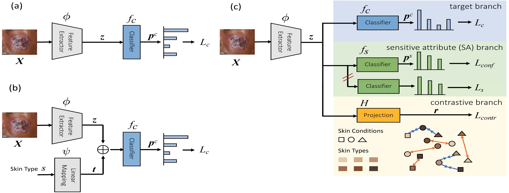

FairDisCo: Fairer AI in Dermatology via Disentanglement Contrastive Learning
====================================================


<p align="center">Diagram of 3  skin disease classifiers: (a) Baseline; (b) Attribute-aware method; (c) Our proposed disentanglement network with contrastive learning (FairDisCo).</p>

This is a PyTorch implementation for [FairDisCo: Fairer AI in Dermatology via Disentanglement Contrastive Learning, ECCV ISIC Workshop 2022].


  * [Requirements](#Requirements)
  * [Data](#Data)
  * [Training](#training)
  * [Evaluation](#evaluation)
  * [Acknowledgements](#acknowledgements)


If you use this code in your research, please consider citing:

```text
@inproceedings{du2022fairdisco,
  title =  {FairDisCo: Fairer AI in Dermatology via Disentanglement Contrastive Learning},
  author =  {Du, Siyi and Hers, Ben and Bayasi, Nourhan and Harmaneh, Ghassan and Garbi, Rafeef},
  booktitle = {Proceedings of the 17th European Conference on Computer Vision Workshops (ECCVW 2022)}
  year =  {2022},
}
```

  <!-- pages = {11125--11132},
  booktitle = {Proceedings of the Thirty-Fourth AAAI Conference on Artificial Intelligence (AAAI-20)} -->


  Requirements
----------------------
This code is implemented using Python 3.8.1, PyTorch v1.8.0, CUDA 11.1 and CuDNN 7. 

```sh
conda create -n skinlesion python=3.8
conda activate skinlesion  # activate the environment and install all dependencies
cd FairDisCo/
conda install pytorch==1.11.0 torchvision==0.12.0 torchaudio==0.11.0 cudatoolkit=11.3 -c pytorch
# or go to https://pytorch.org/get-started/previous-versions/ to find a right command to install pytorch
pip install -r requirements.txt
```


Data
----------------------
1. Download Fitzpatrick17k dataset by filling the form [here][1]

2. Download Diverse Dermatology Images (DDI) from [here][2]

3. Use [data_play_fitz.ipynb][4] and [data_play_ddi.ipynb] to remove unknown skin types, encode disease labels, and generate the weights of reweighting and resampling methods.


Training
---------------------
We have 6 models: baseline (BASE), attribute-aware (ATRB), resampling (RESM), reweighting (REWT), FairDisCo, FairDisCo without contrastive loss. Train one of those models as
```sh
python -u train_BASE.py 20 full fitzpatrick BASE
# or
python -u train_BASE.py 15 full ddi BASE
```

Evaluation
---------------------
Use [multi_evaluate.ipynb][3]


Acknowledgements
----------------

* This code began with [mattgroh/fitzpatrick17k][6]. We thank the developers for building the Fitzpatrick17k dataset and providing the baseline.


[1]: https://github.com/mattgroh/fitzpatrick17k
[2]: https://ddi-dataset.github.io/index.html#dataset
[3]: https://github.com/siyi-wind/FairDisCo/blob/main/multi_evaluate.ipynb
[4]: https://github.com/siyi-wind/FairDisCo/blob/main/data_play_fitz.ipynb
[5]: https://github.com/siyi-wind/FairDisCo/blob/main/data_play_fitz.ipynb
[6]: https://github.com/mattgroh/fitzpatrick17k
